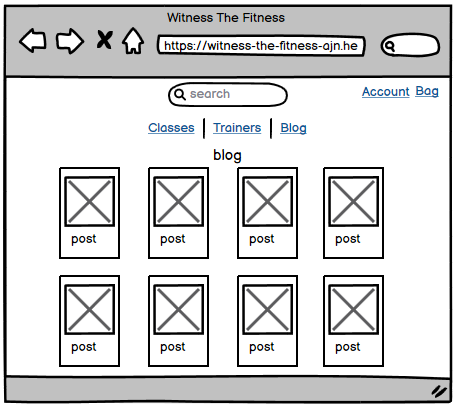
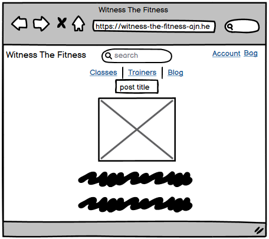
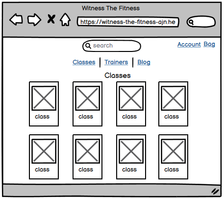
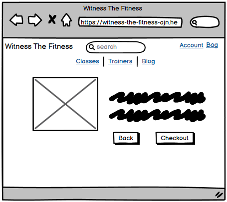
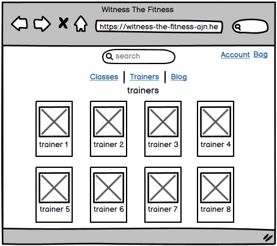
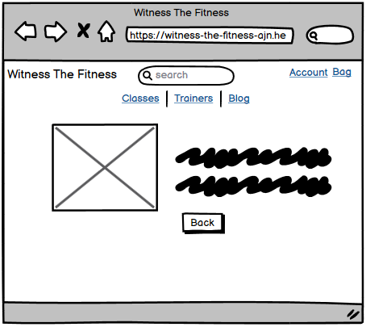
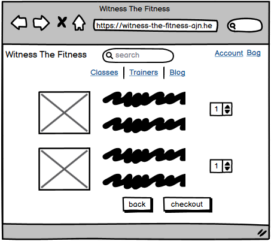
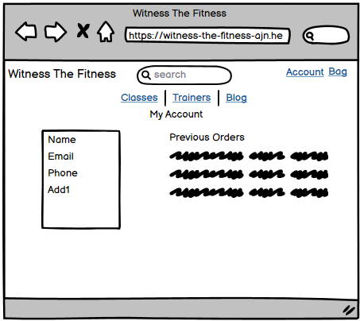

# Witness The Fitness

[Witness The Fitness](https://witness-the-fitness-ajn.herokuapp.com/) is currently a fictional fitness website. It for people intrested in fitness and wellbeing. The purpose of the website is to provide people with the chance to purchase different types of fitness experiences.

## Business Case

TBC

## Planning

### Wireframes

During the planning stage, I created several wireframe templates based on how I wanted the site to look. These are below.

#### **Home**

*Homepage*

#### **Blog**

*Blog*

*Blog Post Detail*

#### **Classes**

*Classes*

*Class Detail*

#### **Trainers**

*Trainers*

*Trainer Detail*

#### **Shopping Bag**

*Shopping Bag*

#### **Profile**

*Profile*

### User Stories

As part of the Agile process I created user stories to aid with planning for the project.

**User**

As a **User**

* I can view the different classes on offer.
* I can click on a class and view more detail.
* I can add choosen classes to a shopping bag.
* I can view and update my shopping bag.
* I can make purchases securely.
* I can register to the site.
* I can view and update my profile.
* I can view my order history.
* I can view blog posts.
* I can like/unlike blog posts.
* I can comment and delete my own comments on blog posts.
* I can view the trainers and their bio's.
* I can view sponsors.

**Admin**

As well as having the same abilities as users, admins also have the additional User Stories.

As an **Admin**

* I can create blog posts.
* I can update/delete blog posts.
* I can add new classes(products).
* I can update/delete existing classes(products).
* I can delete user blog comments if inappropriate.

## Database Models

There are several database Models created for the site and the different apps within it.

### Blog App

#### Post Model
    title = models.CharField(max_length=200, unique=True)
    slug = models.SlugField(max_length=200, unique=True)
    author = models.ForeignKey(User, on_delete=models.CASCADE, related_name="blog_posts")
    created_on = models.DateField(auto_now_add=True)
    featured_image = models.ImageField(null=True, blank=True)
    content = models.TextField()
    excerpt = models.TextField(blank=True)
    updated_on = models.DateTimeField(auto_now=True)
    status = models.IntegerField(choices=STATUS, default=0)
    likes = models.ManyToManyField(UserProfile, related_name="post_likes", blank=True)

#### Comment Model
    post = models.ForeignKey(Post, on_delete=models.CASCADE, related_name="comments")
    name = models.ForeignKey(User, on_delete=models.CASCADE, related_name="user_comments")
    body = models.TextField()
    created_on = models.DateTimeField(auto_now_add=True)

### Checkout App

#### Order Model
    order_number = models.CharField(max_length=32, null=False, editable=False)
    user_profile = models.ForeignKey(UserProfile, on_delete=models.SET_NULL, null=True, blank=True, related_name='orders')
    full_name = models.CharField(max_length=50, null=False, blank=False)
    email = models.EmailField(max_length=254, null=False, blank=False)
    phone_number = models.CharField(max_length=20, null=False, blank=False)
    country = CountryField(blank_label='Country *', null=False, blank=False)
    postcode = models.CharField(max_length=20, null=True, blank=True)
    town_or_city = models.CharField(max_length=40, null=False, blank=False)
    street_address1 = models.CharField(max_length=80, null=False, blank=False)
    street_address2 = models.CharField(max_length=80, null=True, blank=True)
    county = models.CharField(max_length=80, null=True, blank=True)
    date = models.DateTimeField(auto_now_add=True)
    order_total = models.DecimalField(max_digits=10, decimal_places=2, null=False, default=0)
    original_bag = models.TextField(null=False, blank=False, default='')
    stripe_pid = models.CharField(max_length=254, null=False, blank=False, default='')

#### OrderLineItem Model
    order = models.ForeignKey(Order, null=False, blank=False, on_delete=models.CASCADE, related_name='lineitems')
    sport = models.ForeignKey(Sports, null=False, blank=False, on_delete=models.CASCADE)
    quantity = models.IntegerField(null=False, blank=False, default=0)
    lineitem_total = models.DecimalField(max_digits=6, decimal_places=2, null=False, blank=False, editable=False)

### Profiles App

#### UserProfile
    user = models.OneToOneField(User, on_delete=models.CASCADE)
    default_phone_number = models.CharField(max_length=20, null=True, blank=True)
    default_street_address1 = models.CharField(max_length=80, null=True, blank=True)
    default_street_address2 = models.CharField(max_length=80, null=True, blank=True)
    default_town_or_city = models.CharField(max_length=40, null=True, blank=True)
    default_county = models.CharField(max_length=80, null=True, blank=True)
    default_postcode = models.CharField(max_length=20, null=True, blank=True)
    default_country = CountryField(blank_label='Country', null=True, blank=True)

### Sponsors App

#### Sponsors
    sponsor_name = models.CharField(max_length=100, null=False, blank=False)
    sponsor_bio = models.TextField(null=False)
    sponsor_image = models.ImageField(null=True, blank=True)
    sponsor_website = models.TextField(null=False)

### Sports App

#### Sports
    trainer_id = models.ForeignKey(Trainers, on_delete=models.CASCADE)
    sport_type = models.CharField(max_length=100, null=False, blank=False)
    sport_category = models.CharField(max_length=100, null=False, blank=False)
    sport_description = models.TextField(blank=True)
    sport_cost = models.DecimalField(max_digits=6, decimal_places=2, null=False, blank=False)
    sport_location = models.CharField(max_length=100, null=False, blank=False)
    sport_image = models.ImageField(null=True, blank=True)

### Trainers App

#### Trainers
    trainer_name = models.CharField(max_length=100, null=False, blank=False)
    slug = models.SlugField(max_length=200, unique=True, null=True)
    trainer_email = models.EmailField(max_length=254, null=False, blank=False)
    trainer_phone_number = models.CharField(max_length=20, null=False, blank=False)
    trainer_bio = models.TextField(null=False)
    trainer_image = models.ImageField(null=True, blank=True)
    trainer_category = models.CharField(max_length=20, blank=False, null=True)

## **Website Design**

The sites design takes a lot of styling from the Code Institute Boutique Ado follow along lessons. I had used the lessons as a base for the website and intended on spending a lot of time styling and making the site look like my own. Unfortunately, due to family and work commitments I have not been able to dedicate enough time to this project to do this.

### **Header and Footer**

#### **Navbar**
The navbar includes the site title, a search bar and links to various sections of the website including profiles and shopping bag. It is made up of bootstrap classes to aid responsiveness. The search bar allows users to search for the classes on the site.

#### **Footer**
The footer includes a message that the website is for educational purposes. It also features a mailchimp newsletter signup and links to the main areas of the website.

### **Homepage**
The landing page has a background image which presents a fitness feel to the site. There is a message to join one of the availlable classes and also a shopw now button so users can easily navigate to the classes on offer.

### **Classes**
The classes page shows the classes on offer. It consists of a grid in rows of 4 cards. There is an image, category and price for each class on show. Users can click on a choosen class which will open up a more detailed page for that class.

### **Class Detail**
The class detail page is accessed when users click on a class in the classes view. This page has a large image for the class, the class category, price and a description of the class. Users can adjust the quantity they would like to purchase to a maximum limit of 5. There are also buttons to keep shopping and return to the classes page or to add the class to the bag in their chosen quantity. Adding an item to the bag reveals a toast popup which displays a message, highlights what's in the bag and a button to navigate to the checkout page.

### **Trainers**
The trainers page shows the different trainers on the site and their sport category. It is presented in a card like view with a grid of 3 per row. As more trainers are added I would update this to display in rows of 4 to fit in with the styling on the rest of the site.

### **Trainer Detail**
The trainer detail page is opened when a user clicks on a trainer in the trainers view. This view displays a larger image of the trainer, name, sport category and their bio.

## **Future Features**

There are some features I would like to add to the site in the future. I actually intend to try and develop this further into a fully functioning website although, when I do this, the inital focus will be just on personal training.
There are some features that I wanted to include when I first started the project but unfortunately I did not have the time to include these.
There are also other features that I would like to include as I develop the site further. These features are listed here.

* **Calendar Booking**
    * I wanted to include a way to book purchased lessons/classes when I initially planned the project but unfortunately did not have the time to research or include this. Users would be able to book, cancel and rebook lessons. Admins/Trainers would be able to cancel and rebook lessons when needed. Trainers would also be able to add days when classes are being run so users can only book on those days.

* **Social Login**
    * Users would be able to use their social accounts such as google or facebook to register to the site. This was also another feature that I unfortunately did not have time to achieve.

* **Fitness Tracking/Logging**
    * Users would be able to list their fitness journey and would be able to log things such as weight and also specifically for Personal Training, they would be able to track their workouts including weight, reps and distance of their exercises. Where possible, I'd like to include graphs so users can see their journey graphically.

* **Shop**
    * An online shop where users can buy Witness The Fitness branded clothes and accessories and also other brands. There would also be giftcards for sale.

* **Reviews/Ratings**
    * Users would be able to leave reviews for the trainers and classes.

* **Search Bar Capability**
    * Currently the search bar only allows users to search for the classes on offer. I would like to update this so users can search for a wider range of items on the site, such as the various trainers or blog posts.

## **Technologies Used**

**Programming Languages**

* [HTML](https://en.wikipedia.org/wiki/HTML)
* [Python](https://www.python.org/)
* [CSS](https://en.wikipedia.org/wiki/CSS)
* [Javascript](https://www.javascript.com/)

**Supporting Frameworks, Technologies and Credits**

* [Django](https://www.djangoproject.com/) - the base of the project, used for logins, views, forms amongst other things.
* [Bootstrap](https://getbootstrap.com/) - used for website design and responsiveness.
* [Heroku](https://heroku.com) - used for hosting the website.
* [Amazon AWS](https://aws.amazon.com/?nc2=h_lg) - for hosting static files and media.
* [ElephantSQL](https://www.elephantsql.com/) - used for the postgres database.
* [Mailchimp](https://mailchimp.com/) - for newsletter signup
* [Crispy Forms](https://django-crispy-forms.readthedocs.io/en/latest/) - used to format forms across the site.
* [Summernote](https://summernote.org/) - used for text input fields on the website to allow bullet points or numbered lists for fields like recipe instructions.
* [Pixabay](https://pixabay.com/) - images I've used on the site have come from Pixabay.
* [Google Fonts](https://fonts.google.com/) - used for font's on the site.
* [Font Awesome](https://fontawesome.com/) - used for icons across the site.
